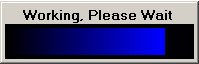



## Fading Progress Bar

### Description

This is a simple 'working' progress bar with a very nice looking fade effect. It doesn't require any external DLL's, ActiveX, or API calls, so no having to tweak it to get it to work in your application!

New version includes a module sub to activate and deactivate the screen, change the color programatically. It is now possible to pass any RGB color value as the primary color, change the fade rate, speed, number of elements. Also includes a control version as well.
 
### More Info
 

             |
---                |---
**Submitted On**   |2004-01-15 07:51:10
**By**             |[Brett Malone](https://github.com/Planet-Source-Code/PSCIndex/blob/master/ByAuthor/brett-malone.md)
**Level**          |Intermediate
**User Rating**    |4.8 (24 globes from 5 users)
**Compatibility**  |VB 6\.0
**Category**       |[Miscellaneous](https://github.com/Planet-Source-Code/PSCIndex/blob/master/ByCategory/miscellaneous__1-1.md)
**World**          |[Visual Basic](https://github.com/Planet-Source-Code/PSCIndex/blob/master/ByWorld/visual-basic.md)
**Archive File**   |[Fading\_Pro1694611152004\.zip](https://github.com/Planet-Source-Code/brett-malone-fading-progress-bar__1-50272/archive/master.zip)

